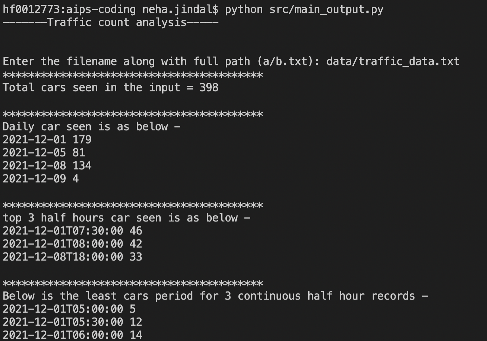

# Background information
An automated traffic counter sits by a road and counts the number of cars that go 
past. Every half-hour the counter outputs the number of cars seen and resets the counter 
to zero.
In the file written, each line contains a timestamp (in yyyy-mm- ddThh:mm:ss format, i.e. ISO 8601) for the beginning of a half-hour and the number of cars seen that half hour.

## Examples
2021-12-01T05:00:00 5 
2021-12-01T05:30:00 12 
2021-12-01T06:00:00 14 
2021-12-01T06:30:00 15 
2021-12-01T07:00:00 25 
2021-12-01T07:30:00 46 
2021-12-01T08:00:00 42 
2021-12-01T15:00:00 9 
2021-12-01T15:30:00 11

### Solution purposed

This repo implements some methods to do some analysis on this file provided by automatic traffic counter in the format as shown above.

`utils/traffic_counter.py` is the main file containing TrafficCounter class to implement the functionality as asked. It is written as an independent class that is modular enough to write the test cases around each method and can be reused and extended for different purposes.

### Functionality implemented
* The number of cars seen in total
* A sequence of lines where each line contains a date (in yyyy-mm-dd format) and the
number of cars seen on that day (eg. 2016-11-23 289) for all days listed in the input file.
* The top 3 half hours with most cars, in the same format as the input file
* The 1.5 hour period with least cars (i.e. 3 contiguous half hour records)

### Assumption 
* Filename passed is always valid filename and file exist with some records.
* Assuming clean input, as these files are machine-generated.
* Every method has enough detail to cover the major decision taken and how it can be used. Documentaion is written in a way that API in html can be generated using third party tools like pydoc if needed.

###  Requirements
To run the code, you should have python installed and this repo uses no third party depenencies as restricted by the coding challenge.

### Run the files

* To run the main file to see the output for different analysis mentioned above, use below command 
`python src/main_output.py`

It will ask you enter the filename with complete path pn which it can perform the analysis. For sake of testing, you can use `data/traffic_data.txt`

After that, you can expect the output looks like below - 

* To run the test cases, you can use below command - 
`python tests/test_traffic_counter.py`

